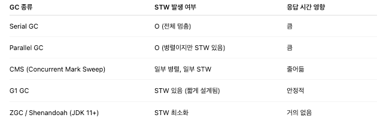

# 2장. 느려진 서비스, 어디부터 봐야 할까
## 처리량과 응답시간
### 응답시간
- 응답 시간 : 사용자 요청을 처리하는 데 걸리는 시간
  - API 요청 (서버에 연결, 서버로 데이터 전송)
  - 서버 실행 
  - API 응답 (클라이언트로 데이터 전송)
- 응답시간은 2가지로 나누어 측정하기도 함
  - TTFB (Time To First Byte) : 응답 데이터 중 첫번째 바이트가 도착할 때까지 걸린 시간
  - TTLB (Time To Last Byte) : 응답 데이터 중 마지막 바이트가 도착할 때까지 걸린 시간
- 응답데이터 크기가 작다면 TTFB, TTLB 차이가 크지 않지만, 파일 다운로드처럼 전송할 데이터 크기가 크거나, 네트워크 속도가 느릴 경우 차이가 커질 수 있다
  - **데이터 특성, 네트워크 환경을 고려**하여 적절한 지표를 선택하여 측정해야 한다

### 처리량
- 처리량 : 단위 시간 당 시스템이 처리하는 작업량
  - TPS, RPS
- 응답시간을 개선하기 위해서는
  - 서버가 동시에 처리할 수 있는 **요청 수를 늘려서** 대기 시간 줄이기
  - **처리 시간 자체를 줄여서** 대기 시간 줄이기 
- 성능을 개선하려면 **현재 서버의 TPS 와 응답시간을 알아야 한다** -> 모니터링 시스템 활용
  - 더욱 정확한 TPS 를 알고 싶다면 웹 서버 접근 로그를 활용하면 된다 (엘라스틱 서치 활용하여 접근 로그 수집 및 집계)

## 서버 성능 개선 기초
### 병목 지점
- 트래픽 증가하며 성능 문제가 발생하는 주된 이유는, **시스템이 수용할 수 있는 최대 TPS 를 초과하는 트래픽이 유입되기 때문**
- 문제 지점 찾기 : 처리 시간이 오래 걸리는 작업 식별하기

### 수직 확장과 수평 확장
- TPS 를 높이기 위해 무턱대고 서버를 추가해선 안되고, 실제 병목 지점 파악이 필요하다
  - DB 에 문제가 있는데, DB 를 사용하는 서버를 더 늘리면 (스케일 아웃), DB 에 가해지는 부하가 더욱 커진다
- **DB 나 외부 API 에 성능 문제가 발생하지 않는 범위 내에서만 수평 확장을 해야 효과가 있다**

### DB 커넥션 풀
- DB 사용하기 위한 3단계
  - DB 에 연결
  - 쿼리 실행
  - 사용이 끝나면 연결 종료
- 매 요청마다 DB 를 연결하고 종료하면, 트래픽 증가 시 급격히 처리량이 떨어진다 -> `DB 커넥션 풀`로 해결
  - DB 에 연결된 커넥션을 미리 생성해서 보관한다
  - 애플리케이션은 DB 작업이 필요할 때 풀에서 커넥션을 가져와 사용하고, 작업이 끝나면 다시 풀에 반환한다
<br> -> 커넥션 풀 사용 시, **이미 연결된 커넥션을 재사용하기에 응답시간이 줄어든다**

### 커넥션 풀 크기
- **커넥션 풀 크기** : 커넥션 풀에 미리 생성해둘 **커넥션 개수** 지정하는 설정
  - 풀에서 커넥션을 얻기 위해 대기하는 시간을 줄이려면, `전체 응답 시간`과 `TPS` 를 고려하여 커넥션 풀 크기를 지정해야 한다
    - ex. 커넥션 풀 크기 = 5 / 한 요청에서 쿼리 실행시 0.1초 소요 / 1초 처리 가능한 요청 수 50
    - => 즉, 동시에 50개 요청이 들어와도 1초 안에 처리 종료
- 트래픽에 따라 크기를 확장, 축소해서 커넥션 개수를 필요한 만큼만 유지할 수 있다
- **처리량을 높이겠다고 커넥션 풀 크기를 무턱대고 늘리면 안된다. DB 상태를 체크해야 한다**
  - DB 서버 CPU 가 80% 에 육박하는데, 커넥션 풀 크기를 늘리면 DB 에 가해지는 부하가 더 커져 쿼리 실행시간이 급격히 증가할 수 있다.
  - 이 상태에서는 오히려 커넥션 풀 크기를 늘리기 보다는, **오히려 커넥션 풀 크기를 유지하거나 줄여서 DB 서버가 포화상태에 이르지 않도록 해야 한다**
- 연관 옵션
  - maximum_pool_size
  - minimum_idle

### 커넥션 대기 시간
- **대기 시간** : 풀에 사용할 수 있는 커넥션이 없을 때 **커넥션을 얻기 위해 기다릴 수 있는 최대 시간**
  - 지정된 대기 시간 내에 커넥션을 구하지 못하면, DB 연결 실패 에러 발생
  - connection_timeout
- HikariCP 의 기본 대기 시간은 30초로 설정되어 있다
- 응답시간이 중요할 경우 커넥션 대기 시간을 가능한 한 짧게 설정해야 한다.
  - 대기 시간을 짧게 설정하면 커넥션을 얻지 못했을 때 빠르게 에러를 응답해서, 서버의 부하가 증가하는 것도 방지할 수 있다
  - 대기 시간이 길어지면, **클라이언트의 재요청이 발생하면서 동시 트래픽이 더 증가하는 문제가 생길 수 있다**
    - 클라이언트가 요청을 취소하더라도 서버는 이미 처리중인 작업을 백그라운드에서 계속 수행함 (=즉, 요청에 대한 작업을 중단하지 않음)
- 대기 시간을 짧게 설정하면, 서버 부하를 `일정 수준` 으로 유지 가능하며, 서버를 안정적으로 운영하는데 도움이 된다

### 최대 유휴 시간, 유효성 검사, 최대 유지 시간
- 커넥션이 사용되지 않는 시간이 길어지면 연결이 끊길 수 있으며, DB 와의 연결이 끊긴 커넥션을 사용하면 에러가 발생한다
- **최대 유휴 시간** : 사용되지 않는 커넥션을 풀에 유지할 수 있는 최대 시간
  - idle_timeout
- **유효성 검사** : 커넥션이 정상적으로 사용할 수 있는 상태인지 여부를 확인하는 절차
  - validation_timeout
- **최대 유지 시간** : 커넥션의 최대 수명 시간
  - max_lifetime

### 서버 캐시
- DB 서버를 수평 확장하더라도 처리량은 늘릴 수 있지만, 실행 시간이 획기적으로 줄어들지는 않는다
  > 수평 확장은 “더 많은 요청”을 처리하는 데는 유리하지만, **“하나의 요청 처리 시간(실행 시간)”을 줄이는 데는 제한적**
  > - **단일 쿼리는 여전히 단일 노드에서 처리**
  >   - 대부분의 SQL 쿼리는 특정 DB 인스턴스 한 곳에서 실행
  >   - DB를 여러 대로 늘려도 하나의 쿼리 실행 시간은 해당 노드의 성능에 달려 있음 → 느려지는 것도 빨라지는 것도 아님.
  >   - ❗ 예: SELECT * FROM orders WHERE id = 123 — 이건 단일 노드에서 처리됨. 아무리 많은 DB 인스턴스가 있어도 실행 시간에는 영향이 없음.
- DB 서버를 확장하지 않고도, **응답시간과 처리량을 개선하고 싶다면 캐시 사용을 고려하면 된다**

### 적중률과 삭제 규칙
- 적중률 (hit rate) = 캐시에 존재한 건 수 / 캐시에서 조회를 시도한 건 수
- 오래된 데이터를 미리 삭제해두면 불필요한 메모리 사용을 줄일 수 있다 +) 캐시 유효 시간 설정

### 로컬 캐시와 리모트 캐시
- 로컬 캐시 : 서버 프로세스와 동일한 메모리를 캐시 저장소로 사용
  - 장점 : 서버 프로세스와 동일한 메모리 공간을 사용하므로 **캐시 데이터에 빠르게 접근할 수 있다**
  - 단점
    - 캐시에 저장할 수 있는 **데이터 크기에 제한**이 있다 (서버 프로세스가 사용할 수 있는 메모리양에 물리적 한계가 존재하므로)
    - 서버 프로세스 재시작 시 메모리에 존재하던 캐시 데이터가 모두 삭제되어, **일시적으로 캐시 적중률이 순간적으로 떨어질 수 있다**
- 리모트 캐시 : 별도 프로세스를 캐시 저장소로 사용
  - 장점
    - 캐시 크기를 **유연하게 확장 가능** (수평 확장)
    - 서버 프로세스 재시작되어도 레디스에 저장된 캐시 데이터는 그대로 유지
  - 단점 : 속도 (네트워크 통신 필요)
- **캐시에 보관할 데이터 규모가 작고, 변경 빈도가 매우 낮을 경우 로컬 캐시로 충분하다**
  - ex. 최신 공지글 목록 10개
- **데이터 규모가 클 경우, 리모트 캐시**를 사용해야 한다
  - ex. 대형 커머스 개별 제품 정보
- **배포 빈도가 높은 서비스라면 리모트 캐시 사용**을 적극적으로 고려해야 한다
  - 로컬 캐시 사용할 경우 서버 재시작될 때마다 캐시 적중률이 떨어져서 응답 시간도 느려지게 된다

### 캐시 사전 적재
- 트래픽이 순간 급증하는 패턴을 보일 경우, **캐시에 데이터를 미리 저장**하는 것도 고려할 수 있다

### 캐시 무효화
- 유효하지 않은 데이터를 적절한 시점에 캐시에서 삭제하는 것이 중요하다
- 민감한 데이터는 변경되는 즉시 캐시를 무효화해야 한다
- **변경에 민감한 데이터는 로컬 캐시가 아닌, 리모트 캐시에 보관**해야 하는데 로컬 캐시는 자신의 데이터만 변경할 뿐 다른 서버의 로컬 캐시는 변경하지 않기 때문이다
- 변경에 민감하지 않고 데이터 크기가 작을 경우 **캐시 유효시간을 설정하여 주기적으로 갱신하는 방식을 사용**해도 된다

### 가비지 컬렉터와 메모리 사용
- GC 를 사용하는 언어는 **사용이 끝난 객체를 힙 메모리에서 바로 삭제하지 않고 정해진 규칙에 따라 사용하지 않는 메모리를 찾아서 반환한다**
- GC 는 응답시간에 영향을 줄 수 있다. 
  - ex. 자바에서 GC 가 실행되는 동안 **애플리케이션 스레드의 실행이 일시 중단된다**(STW - Stop The World)
  > 💡 **Stop-The-World(STW) 란?**
  > - GC가 메모리를 정리하는 과정에서 JVM이 모든 애플리케이션 스레드를 멈추는 현상
  > - 이때는 요청 처리, UI 이벤트, 백그라운드 작업 등 모든 애플리케이션 로직이 멈춤
  > - 몇 ms ~ 몇 초까지도 발생할 수 있음 (GC 종류와 힙 크기에 따라)
  > 
  > 🚨 **실제로 어떤 문제가 생기냐면**
  > - 사용자가 API 요청 → 마침 그 순간 GC 발생 → 응답이 500ms 이상 느려짐
  > - 게임/실시간 시스템에서 GC가 도는 순간 프레임 드랍
  > - Kafka Consumer가 GC 중이라 할당된 파티션을 못 읽음 → 리밸런싱 발생
  > 
  > **🔍 예시: GC 종류별 특징**
  > 
  > 
  > - 💡 최신 JVM(JDK 11~17 이상)에서는 ZGC, Shenandoah 같은 "Low-Pause" GC로 응답 지연을 크게 줄일 수 있음
- **메모리를 많이 사용하고, 생성된 객체가 많을수록** 사용하지 않는 객체를 찾는 데 시간이 오래 걸려서 **GC 실행 시간이 길어진다**
  - **JVM 에 할당된 최대 힙 크기를 줄이면, GC 가 탐지하고 제거해야 할 미사용 객체의 개수와 크기도 줄어든다.** 따라서 검사해야 할 객체 수가 줄어드는 만큼 GC 수행 시간도 짧아진다
  - 따라서 실제 메모리 사용 패턴에 맞게 `최대 힙 크기`를 조정해야 한다
- 대량으로 객체가 생성되는 것을 방지하려면 **조회 범위를 제한해야 한다**
  - 파일 데이터를 한꺼번에 메모리에 로딩한 후 응답하는 방식을 피해야 한다.
  - 파일 크기와 동시 사용자 수에 따라 메모리 사용량이 급증할 수 있다.
- 대량 트래픽, 높은 성능이 반드시 요구되는 상황이 아닐 경우, GC 로 인한 성능 영향은 비교적 크지 않은 경우가 많다

### 응답 데이터 압축
- 웹 서버가 전송하는 응답 데이터 중 HTML, CSS, JS, JSON 과 같이 `텍스트`로 구성된 응답은 압축하면 데이터 전송량을 크게 줄일 수 있다
  - **데이터 전송량이 줄어든 만큼 전송 시간도 빨라진다**
- 응답 데이터를 압축해서 데이터 전송량을 줄이면 비용에도 영향을 준다 (트래픽 자체가 비용으로 직결되므로)

#### 알아두기. Accept-Encoding 요청 헤더와 Content-Encoding 응답 헤더
- Accept-Encoding 헤더를 통해 서버에 처리할 수 있는 압축 알고리즘을 알린다
  ```http
  Accept-Encoding: gzip, deflate
  ```
- 서버에서 자신이 지원하는 방식이 있을 경우, 해당 압축 알고리즘으로 데이터를 압축한 후 Content-Encoding 응답 헤더를 통해 클라이언트에 전달한다
- 응답 데이터 압축 시 고려할 사항
  - HTML, CSS, JS, JSON 과 같이 텍스트로 구성된 응답은 압축률이 높아 효과적이지만, **jpeg, zip 파일처럼 이미 압축한 데이터에는 다시 압축해도 효과가 없다**
  - 웹 서버에서 압축을 적용해도 방화벽이 이를 해제해서 응답할 수 있다
    > 방화벽이나 중간 네트워크 장비가 HTTP 응답의 압축을 해제(압축 해제 혹은 압축 무시)했는지 확인하려면, 보통 Content-Encoding 헤더를 살펴보는 것이 가장 직접적이고 효과적인 방법

#### 알아두기. 트래픽과 비용
- 온프레미스 환경 사용 시에도네트워크 대역폭에 따라 지불하는 비용이 달라진다.
- 트래픽이 증가하는 추세라면 응답 데이터 크기를 줄일 수 있는지 확인해보자.
> **네트워크 대역폭과 응답 데이터 크기의 관계**
> - 네트워크 대역폭 : 일정 시간 동안 **네트워크를 통해 전송할 수 있는 데이터의 최대 용량(속도)**
>   - 보통 초당 Mbps나 Gbps 단위로 표현
> - 네트워크 트래픽 : 네트워크를 **실제로 통과하는 데이터 양**
> - 응답 데이터 크기 : 특정 요청에 대해 서버가 클라이언트로 보내는 데이터의 실제 용량(바이트 단위)
> - 응답 데이터 크기가 크면 그만큼 전송해야 할 데이터 양이 많아서, **같은 네트워크 대역폭 환경에서는 전송 시간이 길어지고, 네트워크 자원(대역폭)을 더 많이 소비**

### 정적 자원과 브라우저 캐시
- `클라이언트 캐시` 활용 : 서버가 전송하는 트래픽을 줄이면서 브라우저가 더 빠르게 화면을 표시할 수 있다
  - HTTP 프로토콜에서는 데이터 응답 시 `Cache-Control`, `Expire` 헤더를 이용해 클라이언트가 응답 데이터를 일정 시간 동안 저장할 수 있도록 설정 가능
    - Cache-Control 헤더에도 max-age로 유효 시간을 명시하는 것이 더 추천되기 때문에, 현재는 사용이 권장 되지 않고 하위 호환을 위해 사용된다.
  - ```java
    Cache-Control: max-age=60
    ```
    - 특정 주소로부터 이미지를 다운로드하면 해당 파일을 로컬 캐시 (메모리 or 디스크) 에 보관
    - 이후 같은 주소를 60초 이내에 다시 요청 -> 서버에 요청보내지 않고 로컬에 보관한 데이터 사용하여 표시

### 정적 자원과 CDN
- 브라우저 캐시는 **브라우저 단위로 동작**하기에, 동시 접속자 수가 많으면 네트워크가 포화되어 응답시간이 느려진다.
  - 이를 해결하는 방법 중 하나로 `CDN` (Content Delivery Network - 콘텐츠 전송 네트워크) 가 있다
  <br> ex. Amazon CloudFront, Akamai, Cloudflare
- CDN 은 `지역별`로 에지 서버 제공 -> 따라서 클라이언트는 지리적으로 가까운 에지서버에 연결되기에 오리진 서버에 직접 연결하는 것보다 빠르게 콘텐츠에 접근 가능
  - 클라이언트 -> CDN 에지 서버 -> 오리진 서버
- CDN 을 활용하면 오리진 서버에서 직접 콘텐츠를 제공하는 것보다 **트래픽 비용도 적게 든다**
  - 모든 요청이 오리진 서버까지가면 전송량 (아웃바운드 트래픽) 기준으로 비용이 드는데, CDN이 캐싱한 리소스를 대신 제공해주면, 오리진 서버에서 나가는 데이터(아웃바운드)가 줄어듦.

#### 알아두기. 주의 사항
- 용량이 큰 파일 때문에 네트워크 트래픽이 급격히 증가하는 문제 방지하려면, **웹 서버에 크기 제한 설정을 추가**하는 게 좋다
  - 실수로 크기가 큰 이미지를 올렸을 때, 네트워크 포화 + 트래픽 비용이 과도하게 증가하는 것을 방지할 수 있다
  - ex. nginx ; client_max_body_size 지시문 추가

### 대기 처리
- 짧은 시간 동안 폭증하는 트래픽에 대처하려면 서버 + DB 를 미리 증설하는 방법이 있다.
  - 하지만 전체 서비스 시간 중 1% 도 되지 않는 시간을 위한 고정비용이 커지는 문제가 생긴다
- 처리할 수 있는 시스템 처리량을 무작정 늘리기보다는 **수용 가능한 수준의 트래픽만 받아들이고 나머지는 대기처리**하는 방법도 있다
  - 서버 증설 없이도 서비스 안정적으로 제공 가능
  - 사용자의 지속적인 새로고침으로 인한 트래픽 폭증 방지 가능
- 대기 제어 기능을 구현하는 솔루션
  - Cloudflare Waiting Room, Queue-it
### 처리량
- 처리량 : 단위 시간당 시스템이 처리하는 작업량 (TPS나 RPS로 처리량을 나타냄)
  - TPS : 초당 트랜잭션 수
  - RPS : 초당 요청 수

- 두 방법을 적용하면 TPS를 높일 수 있다.
  - 동시에 처리할 수 있는 요청 수를 늘리거나
  - 처리 시간을 단축해야 한다.

- 성능을 개선하려면 먼저 현재 서버의 TPS와 응답시간을 알아야 한다.
- TPS를 확인하는 가장 간단한 방법은 모니터링 시스템을 활용하는 것 (스카우터, 핀포인트, 뉴렐릭)
## 서버 성능 개선 기초
- 트래픽이 증가하면서 성능 문제가 발생하는 주된 이유는 **시스템이 수용할 수 있는 최대 TPS를 초과하는 트래픽이 유입되기 때문**이다. 
- TPS를 높이려면 성능 문제가 발생하는 지점을 찾아야 함
  - 실제 실행 시간 측정 필요 -> 모니터링 도구가 유용

### 수직 확장과 수평 확장
- CPU, 메모리, 디스크 등의 자원을 증가시키는 것 -> `수직 확장` (급한 불을 끄는 방법)
  - 더 빠른 CPU로 바꾸거나 CPU 코어 수를 늘리고 메모리를 확장하고 디스크를 SSD로 변경

  - 장점 : 즉각적인 효과
  - 단점 : 트래픽이 지속해서 증가하면 언젠가 결국 또 성능 문제 발생
- 서버를 추가로 투입해 TPS 높이는 방법 -> `수평 확장`

  - 무턱대고 서버 추가하지는 말고 실제 병목 지점이 어디인지 파악하는 게 중요
  - DB나 외부 API에 성능 문제가 발생하지 않는 범위내에서만 수평 확장을 해야 효과가 있음

### DB 커넥션 풀
- 서버와 DB는 네트워크 통신을 통해 연결되는데 이때 네트워크 연결을 생성하고 종료하는 데 걸리는 시간은 0.5초에서 1초 이상 소요되기도 한다 -> 응답 시간에 영향
- 이런 문제를 피하기 위해 DB 커넥션 풀 사용
  - DB에 연결된 커넥션을 미리 생성해서 보관
  - 애플리케이션은 DB 작업이 필요할 때 풀에서 커넥션을 가져와 사용하고, 작업이 끝나면 다시 풀에 반환
> 스프링 부트는 HikariCP를 커넥션 풀로 사용

### 커넥션 풀 크기
- 커넥션 풀 크기는 커넥션 풀에 미리 생성해둘 커넥션 개수를 지정하는 설정
  - 커넥션 풀 설정에서 가장 중요
- 풀을 늘리면 무조건 좋은가?
  - 크기 증가 → 동시 실행량 증가 → TPS 상승 “가능”
  - 하지만 DB가 이미 CPU 80% 근접 등 포화라면 풀을 늘릴수록 DB 부하가 더 커지고 쿼리 실행 시간(T)이 늘어 오히려 응답 시간이 악화될 수 있다.
  - 결론: 풀 사이즈는 “DB 상태(특히 CPU/락/IO/슬로우쿼리)”를 보면서 조정해야 한다
- 서버 수평 확장도 DB 입장에선 동시 부하 증가라서 본질적으로 같은 문제를 만든다

### 커넥션 대기 시간
- HikariCP 기본 대기 시간은 30초 → 최악의 경우 응답이 30초를 넘길 수 있음
- 서비스 특성에 따라 다르지만 보통 0.5초 ~ 3초 정도로 짧게 잡는 편이 좋다.
- 대기 시간이 길면:
  - 요청이 계속 쌓이고,
  - 사용자는 답답해서 **취소 후 재요청(새로고침)**을 하고,
  - 서버는 이미 처리하던 작업을 즉시 멈추지 못해 동시 트래픽이 더 증가하는 악순환이 발생할 수 있다.

- 대기 시간이 짧으면:
  - 커넥션이 없을 때 빠르게 일시적 오류(429/503 등) 로 반환 가능
  - 서버가 붙잡고 있는 동시 요청 수를 일정 수준으로 유지해서 폭주를 막는 데 도움

### 최대 유휴 시간, 유효성 검사, 최대 유지 시간
- 트래픽이 없는 새벽 시간대처럼 커넥션이 오래 놀면 DB가 연결을 끊을 수 있음
- 이를 막기 위해 커넥션 풀은 보통 아래 기능을 제공:

  - 최대 유휴 시간(Idle Timeout)
    - 일정 시간 이상 사용되지 않은 커넥션을 풀에서 제거
    - DB의 idle timeout보다 짧게 잡으면, DB가 끊기 전에 풀에서 정리 가능
  - 유효성 검사(Validation)

    - 커넥션이 살아있는지 확인(가져올 때 또는 주기적으로)

    - 경우에 따라 SELECT 1 같은 가벼운 쿼리로 검사

  - 최대 유지 시간(Max Lifetime)

    - 커넥션을 무한히 오래 쓰지 않고, 생성 후 일정 시간 지나면 교체

### 서버 캐시


- `hit rate` = 캐시에 존재한 건수 / 캐시 조회 시도 건수
- 적중률이 높을수록:

  - DB 부하 감소

  - 응답 시간 감소

  - 처리량 증가
 
### 적중률과 삭제 규칙
- 캐시는 메모리 한계로 무한 저장이 불가 → 가득 차면 일부를 제거해야 함.

- LRU: 가장 오래 안 쓴 것 제거

- LFU: 가장 덜 쓴 것 제거

- FIFO: 먼저 들어온 것 먼저 제거

- 추가로 TTL(만료시간) 을 둬서 오래된 데이터는 자동 제거 → 메모리 효율 ⬆️


### 로컬 캐시와 리모트 캐시


- 로컬 캐시(인-프로세스 메모리)

  - 장점: 가장 빠름, 구조 단순(네트워크 없음)

  - 단점:
    - 저장 용량이 서버 메모리에 제한

    - 서버 재시작 시 캐시 소멸 → 재가열(warm-up) 동안 성능 하락

- 리모트 캐시(별도 프로세스/서버, Redis 등)

  - 장점:

    - 캐시 용량을 수평 확장 가능

    - 서버 재시작해도 캐시 유지 → 안정적

- 단점:
  - 네트워크 통신 비용으로 로컬보다 느림

  - 운영 복잡도/비용 증가
 
- 선택 기준 (실무 감각)

  - 데이터 규모 작고 변경 적음(예: 공지 10개 목록) → 로컬 캐시도 충분

  - 데이터 규모 큼/트래픽 많음/빈번히 변경 → 리모트 캐시가 유리

  - 배포가 잦아 서버 재시작이 잦음 → 로컬 캐시 적중률이 자주 무너져서 리모트 캐시 고려 가치 ⬆️
 
### 캐시 사전 적재
- 사전 적재가 필요한 상황

  - 특정 시점에 트래픽이 폭발하는 이벤트성 조회(푸시 후 대량 접속 등)

  - 사용자가 몰리기 전에 미리 캐시에 올려두면:
    - 순간 적중률 급락을 막고

    - DB 부하 폭증을 예방할 수 있다.

### 캐시 무효화
- 캐시 무효화가 중요한 이유

  - 원본(DB)이 바뀌었는데 캐시가 안 바뀌면 오래된 잘못된 데이터가 노출됨

  - 변경에 민감한 데이터(가격, 게시글 내용 등):

    - 변경 즉시 무효화/갱신 필요

  - 여러 서버에 로컬 캐시로만 두면 서버별 불일치 위험 → 리모트 캐시 권장

- 덜 민감한 데이터(인기글 목록 등):

  - TTL로 주기 갱신도 가능(예: 10분 TTL)

### 가비지 컬렉터와 메모리 사용
- GC(가비지 컬렉터) 영향

  - 힙 사용량/객체 수가 많을수록 GC 시간이 길어져 Stop-the-world로 응답 지연 가능

  - 힙을 무작정 줄이면 OOM 위험도 있으니 실사용 패턴 기반으로 조정해야 한다.

- 대량 객체 생성 방지

  - 한 번에 너무 많은 데이터를 응답하지 말기(페이징/조회 범위 제한)
  - 파일 다운로드는 전체를 메모리에 올리지 말고 스트리밍으로 처리
  → 동시 사용자 증가에도 메모리 폭증을 방지

### 정적 자원과 브라우저 캐시
- 정적 파일(이미지/JS/CSS)을 Cache-Control/Expires로 캐싱하면

  - 같은 사용자의 재방문 시 서버 트래픽 감소

  - 렌더링 속도 개선

### 정적 자원과 CDN
- 동시에 많은 사용자가 몰릴 때는?

  - 브라우저 캐시가 있어도 “처음 접속한 사용자들”이 많으면 정적 자원 전송으로 네트워크 포화 가능

- CDN을 쓰면:

  - 사용자와 가까운 엣지에서 제공

  - 오리진 서버 트래픽 감소 + 로딩 속도 개선 + 비용 절감 가능

- 운영 주의사항: “큰 파일 업로드 사고”

  - 실수로 매우 큰 이미지(예: 30MB)를 올리면 트래픽/비용이 폭증할 수 있음

  - 웹서버에서 업로드 크기 제한 같은 안전장치 두는 것이 좋다.
 

### 대기 처리
- 단기 폭증(콘서트 예매 등)의 현실

  - 그 짧은 시간(예: 한 달 중 1시간)을 위해 서버는 늘렸다 줄일 수 있어도 DB는 비용/구조상 쉽게 줄이기 어렵다     → 고정비 증가

- 대기 제어(수용량 제한 + 대기열)의 장점

  - 시스템이 감당 가능한 만큼만 받아 서비스를 안정적으로 유지

- 새로고침 유도(재요청)로 트래픽이 더 폭주하는 문제를 줄임 (새로고침하면 순번이 뒤로 밀리게 설계하면 특히 효과적)
