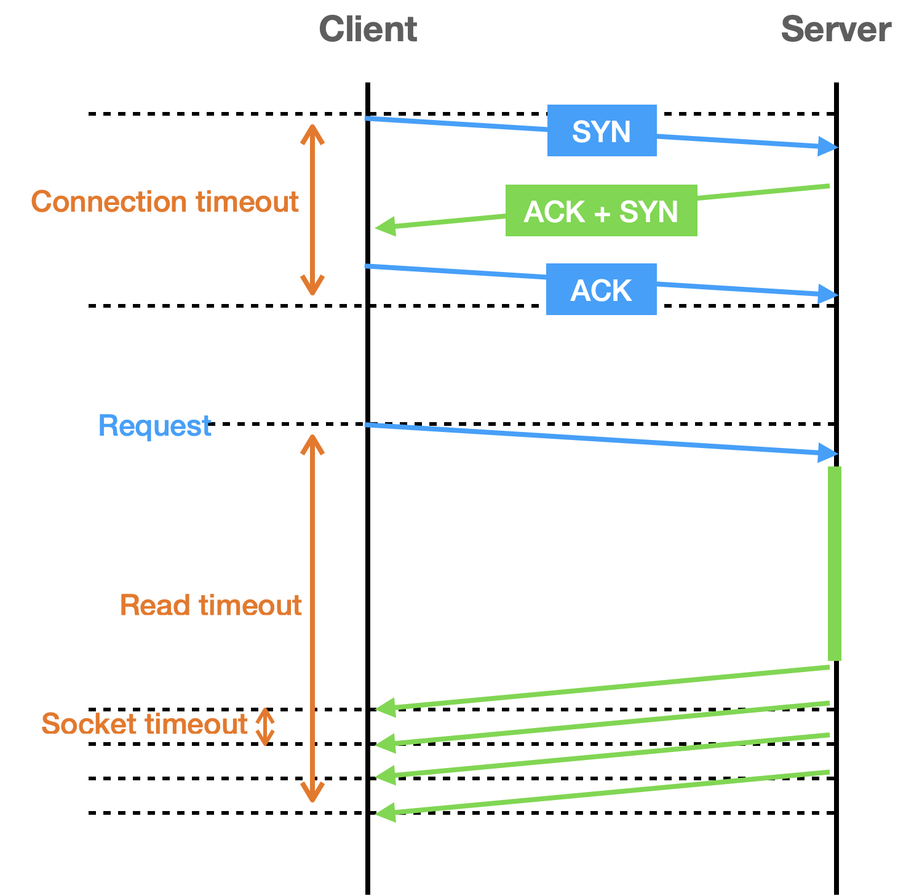

# 4장. 외부 연동이 문제일 때 살펴봐야 할 것들
## 타임아웃
- 연동에 대한 `타임아웃`을 지정하여, 반응 없는 무한대기 보다는 에러 화면이라도 보여주는 것이 낫다
- 서버는 사용자 요청에 대해 (스레드 풀 같은) 자원이 포화되기 전 응답하므로, 연동 서비스 문제가 다른 기능에 주는 영향을 줄일 수 있다

### 2가지 타임아웃: 연결 타임아웃, 읽기 타임아웃

- **연결 타임아웃 (connection timeout)**
  - 연결에 시간이 오래걸리면 대기시간도 함께 증가. 
  - 대기시간 무한정 길어지면 성능 문제 발생하므로 연결 타임아웃 설정을 통해 연결 대기시간을 제한해야 함
- **읽기 타임아웃 (read timeout)**
  - 연결이 되면 요청 전송하고 응답을 기다림
  - 응답을 받기까지 시간이 오래 걸리면 대기 시간 문제가 다시 발생하므로 읽기 타임아웃 설정을 통해 응답 대기 시간을 제한해야 함
- 결제처럼 민감한 기능은 읽기 타임아웃 시간을 약간 길게 설정하여, 간헐적으로 연동 시간이 길어지더라도 정상 처리할 수 있도록 해야 함
- 소켓 타임아웃과 읽기 타임아웃
  - 소켓 타임아웃 : `네트워크 패킷` 단위를 기준으로, 전체 응답 시간에 대한 타임아웃을 의미하진 않는다

## 재시도
### 재시도 가능 조건
- **단순 조회 기능**
  - 재시도를 통해 성공확률을 높일 수 있음
- **연결 타임 아웃**
  - 연결 타임아웃은 연동 서비스에 아직 연결되지 않은 상태이므로, 순간적인 네트워크 문제였다면 재시도를 통해 연결에 성공할 가능성이 있다
  - **읽기 타임아웃의 경우 재시도 시 주의해야 하는데, 이미 연동 서비스가 요청을 처리하고 있는 중이기 때문이다**
- **멱등성을 가진 변경 기능**

### 재시도 폭풍 (retry storm) 안티패턴
- 재시도 검토 시 연동 서비스의 성능 상황도 함께 고려해야 한다

## 동시 요청 제한
- 연동 서비스에 임계치 이상의 요청을 보낼 때 발생하는 성능 저하 문제를 해결하려면, **연동 서비스에 요청을 일정 수준 이상으로 보내지 않는 것이다**
- 연동 서비스에 보내지 않은 요청은 바로 에러를 응답 -> 503 (Service Available) 코드를 사용하면 **과부하 상황임을 클라이언트에 알려 알맞은 오류 메시지 출력 가능**
- **벌크 헤드(bulkhead)**
  - 동시 요청을 제한하는 방식은 벌크헤드 패턴을 이용한 것
  - 각 구성 요소를 `격리`함으로써, **한 구성요소의 장애가 다른 구성 요소에 영향을 주지 않도록 하는 설계 패턴**