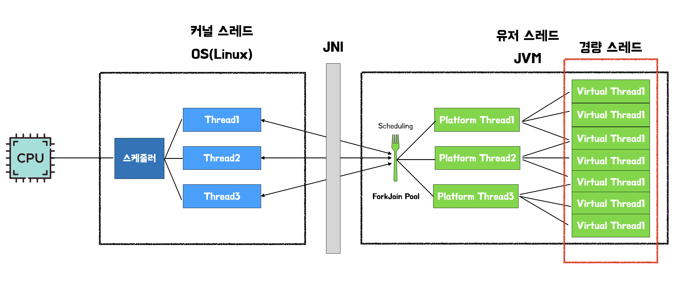

# 7장. IO 병목, 어떻게 해결하지
## 네트워크 IO 와 자원 효율
- DB는 TCP 기반 프로토콜을 사용하여 데이터를 주고 받는다
- 서버는 네트워크 통신을 기반으로 동작한다
```java
outputStream.write(...); // 출력스트림으로 데이터 송신
inputStream.read(...); // 입력스트림으로 데이터 수신
```
- 데이터 입출력이 완료될 때까지 스레드는 `블로킹` 되어 아무 작업도 하지 않고 입출력이 끝나기를 기다린다
  - 입출력 과정에서 블로킹이 발생하므로, 블로킹 IO 라고 하기도 한다
- 스레드가 대기하는데 시간을 소요한다 == **스레드를 실행하는 CPU 가 아무것도 하지 않는 시간이 생긴다**
  - 이 문제를 해결하기 위해 동시에 실행되는 스레드 개수를 늘려서, IO 대기에 따른 CPU 낭비를 줄일 수도 있다
  - 하지만 스레드는 수백 KB ~ 수 MB 메모리를 사용하므로 **사용자가 늘어나면 메모리가 병목이 될 수 있다**
  - 또한 동시 실행되는 스레드 증가 시, 컨텍스트 스위칭에 사용되는 시간도 증가한다
- 컨텍스트 스위칭
  - OS 는 여러 스레드를 번갈아가며 CPU 에 할당
  - 현재 실행 중인 스레드 상태를 기록하고, 다음에 실행할 스레드의 상태정보를 불러오는 과정을 컨텍스트 스위칭이라고 한다
  - 컨텍스트 스위칭을 하는 동안, CPU 는 실질적인 작업을 하지 않는다
- 서버 성능을 높이려면 `자원효율` 을 높이면 된다
  - IO 대기로 인한 **CPU 낭비를 줄이고,**
  - 요청을 처리하는 데 **필요한 메모리를 줄인다**
> **톰캣**
> - 기본적으로 멀티 스레드 모델로 구현됨
>   - 즉, **각 사용자 요청을 1개의 스레드가 처리**하는 thread-per-request 방식으로 동작
> - NIO 기반의 톰캣 동작 방식 -> 추가 필요
> - Thread 의 Idle 상태를 줄이기 위해 EventLoop 방식의 Reactive Programming이 개발됨
> 
> **thread-per-request vs. event loop** > 🔥 찾아보기

## 가상 스레드로 자원 효율 높이기

- CPU 효율을 높이기 위한 방법 : 가상스레드 (자바), 고루틴 (Go) => `경량 스레드`
- 경량 스레드 : OS 가 관리하는 스레드가 아니라, JVM 과 같은 **언어의 런타임이 관리하는 스레드**
  - OS 가 CPU로 실행할 스레드를 스케줄링하듯, **언어 런타임이 OS 스레드로 실행할 경량 스레드를 스케줄링**한다
- JVM 은 **플랫폼 스레드 (OS 스레드에 1:1 대응하는 래퍼)** 로 구성된 스케줄러 풀 유지 
  > 🔥 플랫폼 스레드 <> OS 스레드 간 관계
  - 캐리어 (carrier) 스레드 : 가상 스레드 실행하는 플랫폼 스레드
  - 하나의 캐리어 스레드 -> 여러 가상 스레드 실행
- CPU 가 OS 스케줄러에 의해 여러 스레드를 번갈아 실행하듯, **플랫폼 스레드도 JVM 스케줄러에 의해 여러 가상 스레드를 번갈아 실행**
  - **기본적으로 JVM 는 풀에 CPU 코어 개수만큼 플랫폼 스레드 생성** + 동적 증감
  - 가상스레드 - 캐리어 스레드가 연결되는 것을 `마운트` 되었다고 표현
  - 가상스레드가 캐리어 스레드에 마운트되면 가상 스레드 실행. 언마운트 되면 실행 중지
- 가상 스레드를 경량스레드라고 부르는 이유는, **플랫폼 스레드보다 더 적은 자원을 사용하기 때문이다**
  - 플랫폼 스레드 (즉,  OS스레드) 보다 더 적은 메모리 사용
  - 가상 스레드는 수백 byte ~ 수십 KB 의 힙메모리 사용. 호출 스택 깊이에 따라 사용하는 메모리를 동적 조정

### 네트워크 IO와 가상 스레드
- 가상스레드 실행과정 중 **블로킹** (IO기능, ReentrantLock - JAVA 에서 동시에 여러 개의 스레드가 접근하는 것을 제어하기 위한 동기화 메커니즘, Thread.sleep()) **되면 플랫폼 스레드와 언마운트 + 실행 중지**<br>언마운트된 플랫폼 스레드는 실행 대기중인 다른 가상스레드와 연결 뒤 실행 재개
- **synchronized 로 인해 블로킹될 경우, 가상 스레드 - 플랫폼 스레드로부터 언마운트되지 않고 `고정됨`**
  - 이 외에도 JNI 호출에 의해서도 고정될 수 있는데, 가상 스레드 고정 시 CPU 효율 높일 수 없음
  > 🔥 고정되는 케이스 ex. JNI 호출

### 가상 스레드와 성능
- IO 중심 작업 : 입출력이 주 작업 (ex. 네트워크 프로그래밍)
  - 이 작업일 때 **플랫폼 스레드가 CPU 낭비 없이 효율적으로 가상 스레드 실행 가능**
- CPU 중심 작업 : 계산이 주 작업 (ex. 정렬)
> IO / CPU 작업 예시
> - IO 작업 : **입출력 장치** (CPU 와 메모리 밖에 있는 것들 - 하드디스크, 네트워크 카드, 키보드, 프린터 등) **와의 데이터 교환을 위해 대기 시간이 발생하는 작업**
>   - 파일 시스템 (파일 I/O) / 네트워크 (HTTP 요청, DB 쿼리 - DB I/O, API 호출 - 네트워크 I/O), 키보드 입력 대기 등
> - CPU 작업 : 프로세서의 **연산 능력을 집중적으로 사용하는 작업**
>   - 암복호화, 데이터 처리 (알고리즘, 인코딩, 압축), 분석 (데이터 분석, 모델 학습) 등
- IO 중심 작업이라고, 무조건 가상 스레드 이점을 얻는 것도 아님.<br> 스케줄링에 사용되는 **플랫폼 스레드 개수 <= 가상 스레드 개수** 여야 효과 기대 가능
  - 따라서 가상 스레드 개수가 플랫폼 스레드 개수보다 많아지도록 **CPU 코어 수를 줄이거나** (기본적으로 플랫폼 스레드 - CPU 코어 수 동일하기 때문), 트래픽이 더 많아져야 한다
- 가상 스레드와 스레드 풀
  - 가상 스레드는 플랫폼 스레드보다 생성 비용이 적기에 스레드 풀을 미리 구성할 필요가 없다 > 🔥 자세히 알아보기 ✅ <br>(결국 여기서 말하는 플랫폼 스레드가 스레드풀의 대상이 되는 스레드인건가?)
    > 플랫폼 스레드는 기존 일반적인 자바 스레드 (=스레드풀에서 관리하는 스레드) 이고, 얘는 생성비용이 비싸서 스레드풀이 필요했음. <br> 하지만 가상스레드는 생성 비용 / 메모리 / 생성시간 / 개수면에서 플랫폼 스레드보다 훨씬 성능이 우수함

### 가상 스레드의 중요한 장점
- 기존 코드의 큰 수정 없이 서버 성능을 높일 수 있다

## 논블로킹 IO 로 성능 더 높이기
> 들어가기 전, 동기 & 비동기 vs 블로킹 & 논블로킹
> - 동기/비동기 : 요청한 작업에 대해 **완료 여부를 신경 써서 작업을 `순차적`으로 수행할지 아닌지**에 대한 관점
> - 블로킹/논블로킹 : 현재 작업이 block(차단, 대기) 되느냐 아니냐에 따라 **다른 작업을 수행할 수 있는지**에 대한 관점

### 논블로킹 IO 동작 개요
- 논블로킹 IO 는 블로킹 IO 처럼 데이터를 조회했다는 가정하에 코드를 짤 수 없으므로, 루프 안에서 조회를 반복해서 호출한 후 데이터를 읽었을 때만 처리하는 방식으로 구현 가능 !
1. 실행 가능한 IO 연산 목록 구하기 (실행 가능한게 없을 경우 계속 대기)
2. 1에서 구한 IO 연산 목록 차례로 순회 -> 각 IO 연산 수행
- 논블로킹 IO 에서 동시성을 높이기 위해서는, 채널 > N개 그룹으로 나누고, 각 그룹마다 스레드를 생성한다
- IO 멀티 플렉싱
  - 단일 이벤트 루프에서 여러 IO 작업을 처리하는 개념 표현 시 사용 > 🔥 단일 이벤트 루프라는게 단일 스레드 or 프로세스 의미?
  - OS 에 따라 epoll (리눅스), IOCP (윈도우) 등을 사용해서 구현
### 리액터 패턴
- 리액터는 이벤트 발생까지 대기하다가, 이벤트 발생 시 알맞은 핸들러에 이벤트를 전달한다
  - 따라서 리액터를 이벤트 루프라고 하기도 함
- 이 패턴에서 이벤트 루프는 `단일 스레드`  로 실행되는데, 핸들러에서 CPU 연산 또는 블로킹 유발 연산 수행 시 처리 시간이 지연된다
  - 이런 한계를 보완하기 위해 핸들러 or 블로킹 연산을 별도 스레드 풀에서 실행하기도 함
  - e.g., Netty - 여러 이벤트 루프 생성해서 멀티 코어 활용, Node.js - 이벤트 루프 외 별도 스레드 풀 사용

## 언제 어떤 방법을 택할까
> 1. 성능 문제가 있는가?
> 2. 성능 문제가 있다면, 네트워크 IO 관련 성능 문제인가?
>    - 트래픽이 그대로인데 DB 쿼리 시간 지연 => 쿼리 최적화, 캐시 사용 필요
>    - CPU 중심 작업 => 블로킹 IO 가 없으므로 가상스레드 / 논블로킹 IO 적용해도 응답시간 감소 불가
> 3. 구현 변경이 가능한가?
