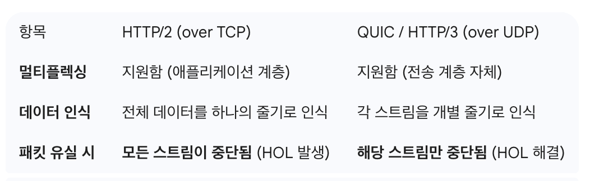

# 10장. 모르면 답답해지는 네트워크 기초

## 노드, 네트워크, 라우터
- 패킷 : 노드 (데이터 송수신하는 모든 장치) 가 `네트워크`를 통해 전송하는 데이터 단위
  - 헤더 : 패킷의 발신자, 수신자 포함
  - 페이로드 : 데이터 포함
- 서로 다른 네트워크에 속한 노드 간 직접 연결 + 패킷 송수신은 불가하므로, 이 때 `라우터` 가 사용된다 
  - 라우터 : 네트워크 간 패킷 전송
  - 두 노드 간 다양한 라우터 경로 존재 가능 

## IP 주소와 도메인
### 고정 IP 와 동적 IP
- 동일 네트워크 상에서 각 노드는 서로 다른 IP 주소를 가져야 한다
  - IP 주소를 사용해서 패킷을 전송할 노드 선택하기에 IP 주소가 같을 경우, 충돌이 발생한다
- 고정 IP : 노드가 고정된 IP 를 가짐 (노드가 IP 주소 직접 지정) e.g., 서버 IP
- 동적 IP : 노드가 네트워크에 연결할 때마다 IP 할당 e.g., 공유기
  - **동적 IP 는 DHCP (Dynamic Host Configuration Protocol) 서버를 통해 제공 받음**

### 공인 IP 와 사설 IP
- 공인 IP : 인터넷에서 접속하는 모든 네트워크에 적용되는 주소
- 사설 IP : 특정 네트워크에 속한 노드에 할당하는 주소, 네트워크 외부 접근 불가 
  - e.g., 공유기에 연결된 휴대폰, 태블릿, 컴퓨터
- 공인 IP 는 서로 같은 주소를 가질 수 없지만, **사설 IP 는 네트워크가 다를 경우 같은 주소를 가질 수 있다**

### NAT
- NAT (Network Address Translation) : 네트워크 주소를 변환하는 기술
  - 인터넷 연결 시, 내부에서 사용하는 사설 IP <> 인터넷에서 사용하는 공인 IP 주소 간 변환을 담당
  - 주로 인터넷에 연결된 라우터 같은 네트워크 장비가 담당
- 내부 네트워크에서 나가는 패킷의 사설 IP -> 공인 IP 로 변환 
  - 소스 IP 주소를 변환한다고 해서 `SNAT` (Source NAT) 이라고 부름 e.g., 집에서 공유기를 통해 네이버에 접속하는 상황
- 공인 IP 로 들어온 패킷의 목적지 -> 사설 IP 로 변환
  - 목적지 IP 주소를 변환한다고 해서 `DNAT` (Destination NAT) 이라고 부름
    - 서버 구성 시 사용됨
    - 공인 IP 주소는 네트워크 연결 관리하는 장비 (라우터, 방화벽 등) 에 할당. 
    - 해당 장비는 DNAT 을 이용해서 공인 IP로 들어온 패킷을 사설 IP 를 가진 서버 노드에 전송

### VPN
- VPN (Virtual Private Network) : 서버 운영 시 서버 네트워크에 구성된 노드에 안전하게 접근할 수 있도록 하는 방법
  - **인터넷과 같은 공용 네트워크에서, 서로 다른 네트워크 간에 암호화된 연결 제공**

### 프로토콜과 TCP, UDP, QUIC
- TCP/IP 모델에는 4계층이 존재 -> 각 계층 별 사용되는 주요 프로토콜
  - 애플리케이션 계층 : HTTP / FTP / SMTP
  - 전송 계층 : TCP / UDP
  - 네트워크 계층 : IP
  - 데이터 링크 계층
  - 물리 계층
- TCP : **신뢰성이 있지만 느리다**
  - 연결 기반 프로토콜
  - 장점 - 신뢰성 
  - 패킷 순서 보장. 패킷 유실 시 재전송 기능 -> 안정적인 데이터 전송
  - 일부 패킷 유실 시 해당 패킷 도착할 때까지 이후 패킷을 제대로 처리하지 못하는 HOL 블로킹 (Head-of-Line Blocking) 문제 존재
- UDP : **빠르지만 신뢰성이 없다**
  - 연결 과정 없이 데이터 전송
  - 데이터 정상 전송 여부 확인 불가. 순서 미보장
  - TCP 보다 전송속도 빠름
  - 속도가 중요, 일부 데이터가 유실되더라도 문제 없는 통신에 주로 사용
  - e.g., DNS, VoIP (카카오톡 보이스톡이나 Zoom 같은 인터넷 전화), 게임
- TCP, UDP 의 장점만 합치기 위해 개발된 프로토콜이 `QUIC` 이다
- QUIC
  - UDP 기반. TCP 연결 관리 기능/TCP 혼잡 제어 및 패킷 유실 복구 기능을 QUIC 프로토콜 수준에서 제공
  - TLS (Transport Layer Security) 통합
    - TLS
      - 인터넷상에서 컴퓨터 간의 통신을 암호화하여 데이터 기밀성, 무결성, 인증을 제공하는 보안 프로토콜
      - 과거 SSL(Secure Sockets Layer)의 표준화된 후속 버전
      - HTTPS(HTTP Secure)의 핵심 기술로 사용되어 웹 브라우징, 이메일 등 데이터를 안전하게 전송하는 역할
    - **TCP 기준 HTTPS 는 TCP 연결을 위한 3-way handshake + TLS 연결을 위한 TLS handshake 진행후 연결 수립되나, QUIC 는 TLS 를 통합함으로써 과정을 단축함**
  - 
  - 멀티플렉싱 지원 (한 연결에서 여러 스트림 동시 처리 가능)
    -  멀티 플렉싱 : 두 개의 클라이언트를 위해서 두 개의 프로세스, 두개의 스레드를 두는 것이 아니라
하나의 서버에서 두 클라이언트를 모두 처리하는 것
    - 여러 스트림을 동시에 처리하므로 1개 스트림에서 HOL 블로킹 발생해도 다른 스트림에 영향 주지 않음
      - HTTP/2 도 멀티플렉싱 지원하지만 TCP 자체에서 발생하는 HOL 블로킹 문제 피할 수는 없다
      - 